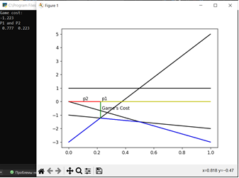

# Описание задачи

Матрица в задании:

``` 
2 4
1 -3 0 -1
1 5 -3 -2
```

Программа должна прочитать из файла размерность и матрицу.
Далее для каждой строки или, соответственно, столбца вычисляются массивы k[i] и c[i] линейных уравнений строк/столбцов y=kx+c. 

Для этих уравнений отобразить графики черного цвета, построить график огибающей снизу/сверху синего цвета с точностью 3 знака, зеленым цветом выделить отрезок цены игры, желтым и красным  отрезки p1, p2 (соответственно q1,q2). На консоль вывести цену игры и вероятности p1,p2 (q1,q2).

# Тестирование работы программы

