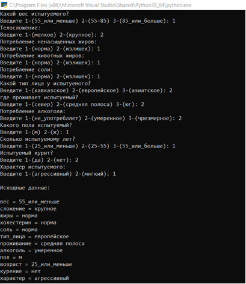

# Описание задачи

На Python реализовать экспертную систему, основанную на фактах и правилах по оценке продолжительности жизни.  

После чтения файлов factvalues.txt, questions.txt, rules.txt программа задает вопросы, ответы вводятся (1 2 3) и система выводит доказанные утверждения с указанием правил, по которым они получены. 

# Тестирование работы программы

