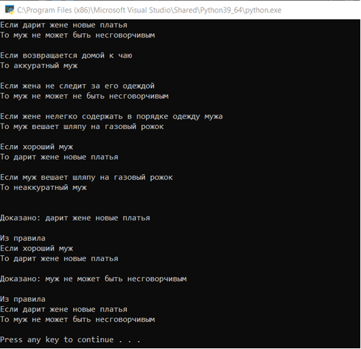

# Описание задачи

Применить понятие классов для решения логической задачи сорита Л. Кэрролла. 
Сорит по варианту из оригинальной постановки Кэрролла записать в виде набора Если … То…
и кратко в файл. 

Программа должна считать правила и по одному начальному  факту доказать остальные. Данные в файле должны быть расположены так, чтобы итерации по правилам выполнялись несколько раз.

1.	Ни один муж, дарящий жене новые платья, не может быть несговорчивым.
2.	Аккуратный муж всегда возвращается домой к чаю.
3.	Жене нелегко содержать в порядке одежду мужа, если он имеет обыкновение вешать свою шляпу на газовый рожок.
4.	Хороший муж всегда дарит своей жене новые платья.
5.	Ни один муж не может не быть несговорчивым, если жена не следит за его одеждой.
6.	Неаккуратный муж всегда вешает свою шляпу на газо¬вый рожок.

# Тестирование работы программы

