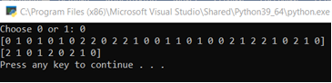
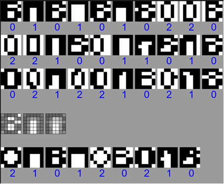
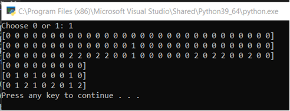
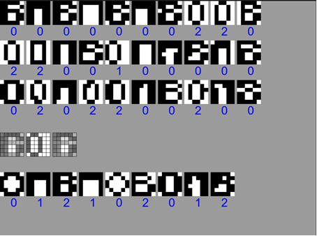

# Описание задачи

По варианту создать и записать в файл 30 битовых изображений 6х6 по 10 каждого класса. Кроме этого, создать по 3 изображения для каждого класса и записать в другой файл. 
При запуске считываются изображения и с консоли вводится 0 - K - внутригрупповых средних, 1 - максиминное расстояние.

После кластеризации выводятся изображения с подписью номера присвоенного класса и в виде полутоновых изображений изображения всех классов. 
После этого,  считываются тестирующие изображения, выводятся на экран с подписью  к какому классу были отнесены.

Вариант 12:
## В П О 

# Тестирование работы программы

Кластеризация через внутригрупповые средние

Кластеризация через максиминные расстояния

