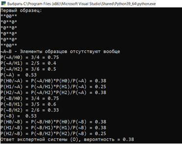

# Описание задачи
Из выборки лаб. 5 по вариантам взять 4, 5, 6 образов каждого из трех классов. Выбрать 2 небольших шаблона типа: 
```
A	
00
0

B
0*0
```

Определить условные вероятности *p(A/Hi)* и *p(B/Hi)*. 

Все 6 вероятностей не должны быть равны 0 и 1 и не равны между собой.  
Далее поданы 4 образа, в которых отсутствуют элементы A и B, присутствует один из элементов и присутствуют оба элемента.  Вычислить все апостериорные вероятности AB, A~B    ~AB, ~A~B, в каждом случае по максимуму из них найти ответ экспертной системы. 

Шаблоны и образы подобрать так, чтобы при пересчетах всех 8 вероятностей ни одна не становилась равной 0 или 1.

# Тестирование работы программы





