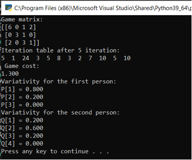
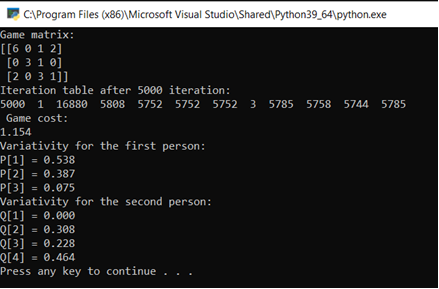

# Описание задачи
Реализовать алгоритм решения игры итерационным методом. 

Программа должна считывать из файла размерность и матрицу игры и выводить  последовательно таблицу для небольшого K=5. Затем взять k=5000 и программа должна вывести цену игры и вероятности, которые должны совпасть с п.2. 

Промежуточные таблицы не выводить.

# Тестирование работы программы

Иттерационный метод при k = 5

Иттерационный метод при k = 5000

