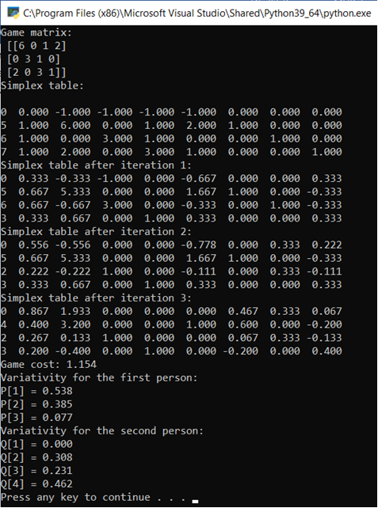

# Описание задачи

Реализовать алгоритм решения игры симплекс методом. 

Программа должна считывать из файла размерность и матрицу игры и выводить  последовательно все симплекс таблицы. 

В конце программа выводит цену игры и вероятности.

# Тестирование работы программы

