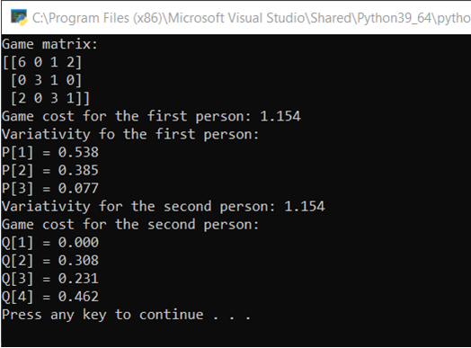

# Описание задачи

Реализовать алгоритм решения игры симплекс методом с использованием scipy. 

Программа должна считывать из файла размерность и матрицу игры и решить задачу для P[i], затем  для Q[i].
# Тестирование работы программы

