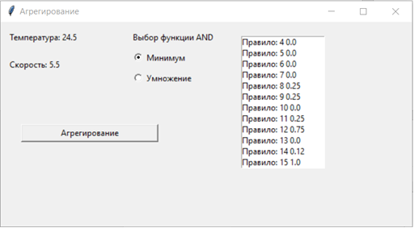
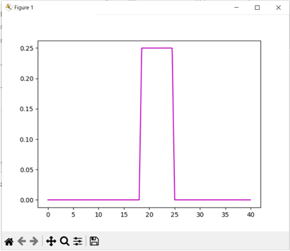
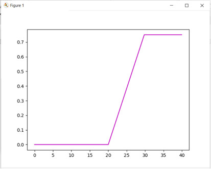

# Описание задачи
### Выполнить по варианту алгоритм Мамдани для выбранных конкретных значений.
Алгоритм содержит этапы 
1. фаззификация 
2. агрегирование 
3. активизация 
4. Аккумуляция
5. Дефаззиификация

В итоге получается управляющее воздействие.
Необходимо, чтобы на каждом этапе строились  все необходимые графики, как в лекции. 
Функции принадлежностей могут быть трех типов: трапецевидная, S типа и Z типа. 
Вариант 10. 
Модель управления кондиционером
Входными переменными являются режим кондиционера, температура в помещении, скорость изменения температуры со следующими функциями принадлежности:

1. Режим работы кондиционера
2. Температура в помещении
3. Скорость изменения температуры
 

### Сформулированные нечеткие правила: 
1.	Если в помещении очень тепло и скорость температуры высокая, то следует включить режим «холод», повернув регулятор на режим 1  
2.	Если в помещении очень тепло и скорость температуры средняя, то следует включить режим «холод», повернув регулятор на режим 1  
3.	Если в помещении очень тепло и скорость температуры низкая, то следует включить режим «холод», повернув регулятор на режим 2  
4.	Если в помещении тепло и скорость температуры высокая, то следует включить режим «холод», повернув регулятор на режим 2  
5.	Если в помещении тепло и скорость температуры средняя, то следует включить режим «холод», повернув регулятор на режим 2
6.	Если в помещении тепло и скорость температуры низкая, то следует включить режим «холод», повернув регулятор на режим 2
7.	Если в помещении нормально и скорость температуры высокая, то следует не включать режимы, повернув регулятор на режим 3  
8.	Если в помещении нормально и скорость температуры средняя, то следует не включать режимы, повернув регулятор на режим 3  
9.	Если в помещении нормально и скорость температуры низкая, то следует не включать режимы, повернув регулятор на режим 3  
10.	Если в помещении холодно и скорость температуры высокая, то следует включить режим «тепло», повернув регулятор на режим 4  
11.	Если в помещении холодно и скорость температуры средняя, то следует включить режим «тепло», повернув регулятор на режим 4  
12.	Если в помещении холодно и скорость температуры низкая, то следует включить режим «тепло», повернув регулятор на режим 4  
13.	Если в помещении очень холодно и скорость температуры высокая, то следует включить режим «тепло», повернув регулятор на режим 4  
14.	Если в помещении очень холодно и скорость температуры средняя, то следует включить режим «тепло», повернув регулятор на режим 5  
15.	Если в помещении очень холодно и скорость температуры низкая, то следует включить режим «тепло», повернув регулятор на режим 5  

Лингвистическими входными переменными является:  температура в помещении и скорость изменения температуры. Скорость имеет три терм-множества: низкий, средний и высокий. Температура в помещении имеет 5 множеств: очень холодно, холодно, нормально, тепло, очень тепло
Для каждого терма строится функция принадлежности, которые можно изобразить на одном графике.
 

# Тестирование работы программы

Температура в помещении

Скорость изменения температуры

Режим работы кондиционера

Фаззификация

Агрегирование

Активизация

Аккумуляция методом максимумов

Аккумуляция методом сложения

Дефаззификация

