# Описание задачи

По варианту создать и записать в файл 45 битовых изображений 6х6 по 15 каждого класса. 

Кроме этого, создать по 10 изображений для каждого класса и записать в другой файл. Для каждого образа обучающей выборки и тестирующей указывается номер класса, к которому он относится.

После тестирования выводятся изображения с подписью истинного номера изображения всех классов и активности выходного слоя.

# Тестирование работы программы

### Определение символов 
#### В П О

Обучающая выборка

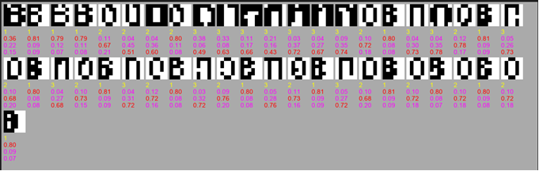

Обучение

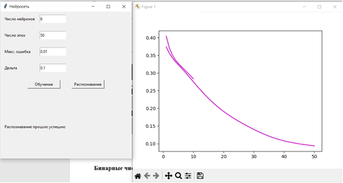

Тестирующая выборка

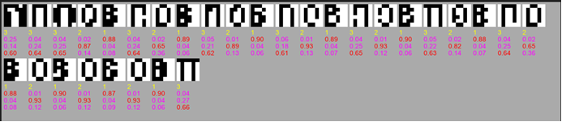

### Обучение на бинарных числах

График обучения

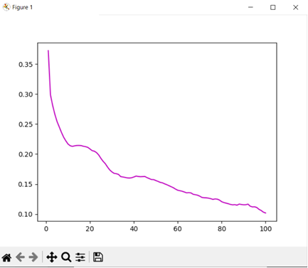

Данные для обучения 

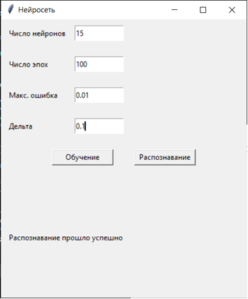

Результат обучения

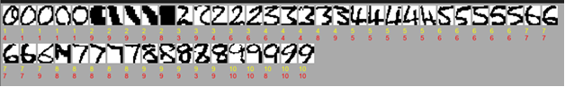

### Обучение на полутоновых числах

График и его данные для обучения

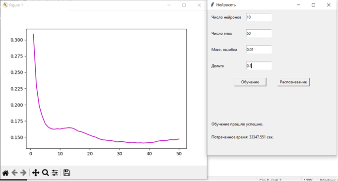

Результат обучения

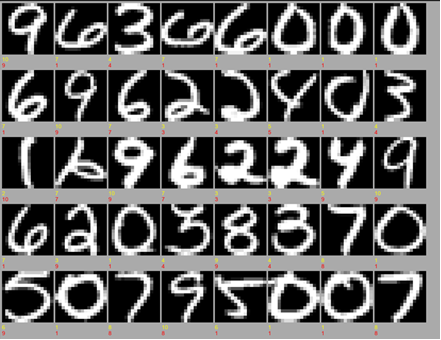

### Обучение на лицах (5 классов)

График и его данные для обучения

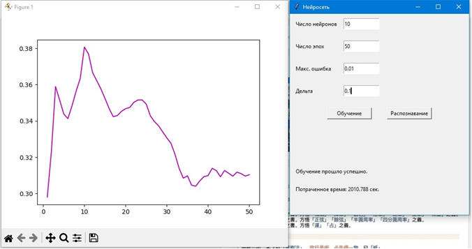

Результат обучения

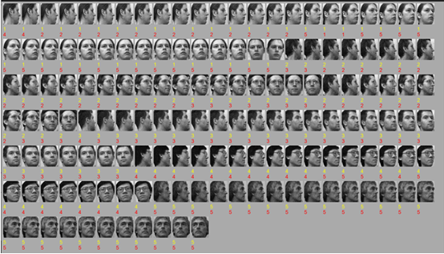

### Обучение на лицах (10 классов)

График и его данные для обучения

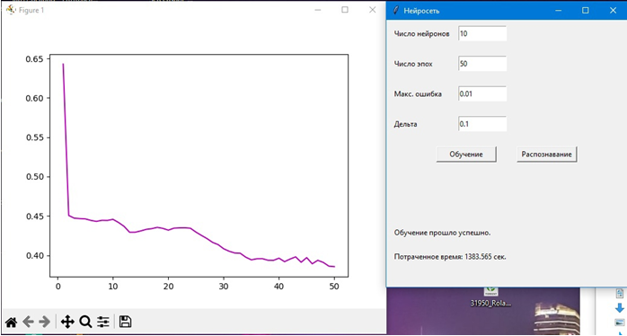

Результат обучения

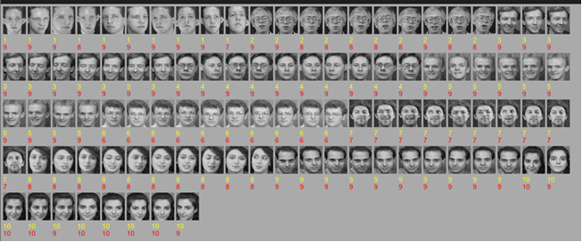