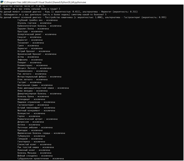
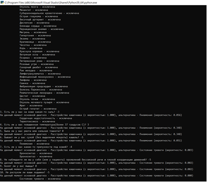
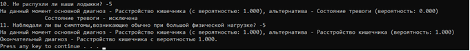

# Описание задачи

Реализовать программу на Питоне диагностики заболевания. 
На защите запустить с несколькими шагами. Должно появиться  сообщение: 
```
Диагноз … исключен.
```
Продемонстрировать полную диагностику до конца. 

Поскольку имеются случайные значения и различные ответы, будут получены разные варианты диагностики.

# Тестирование работы программы





